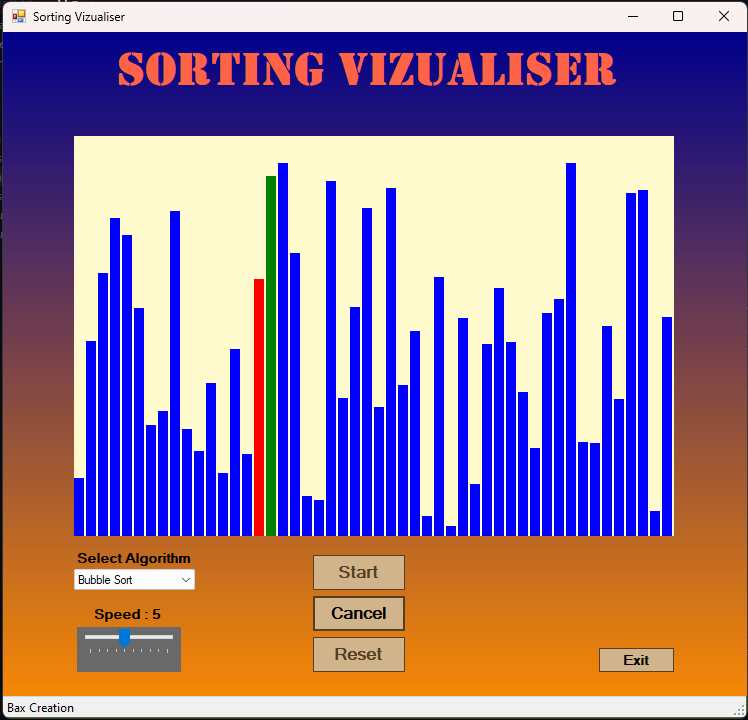
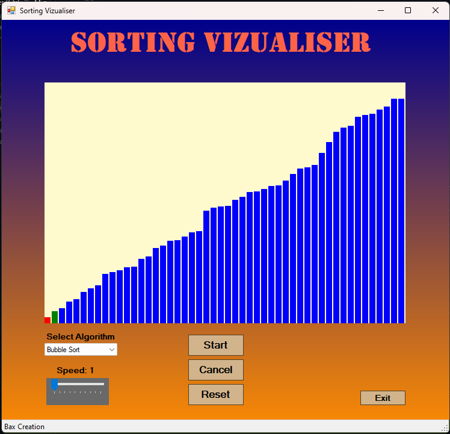

# Sorting Visualizer

Welcome to the **Sorting Visualizer**! 
This application provides an interactive and,
educational way to visualize sorting algorithms in action.

---

## Features

- A variety of popular sorting algorithms.
- Adjustable speed control for sorting visualization.
- Dynamic bar generation with random heights.
- Interactive interface with gradient backgrounds for an improved UI experience.

---

## Implemented Sorting Algorithms

- **Bubble Sort**
- **Selection Sort**
- **Insertion Sort**
- **Merge Sort**
- **Quick Sort**
- **Heap Sort**
- **Counting Sort**
- **Radix Sort**
- **Shell Sort**
- **Bucket Sort**
- **Tim Sort**
- **Pigeonhole Sort**
- **Gnome Sort**
- **Comb Sort**
- **Cycle Sort**
- **Bitonic Sort**
- **Odd-Even Sort**
- **Flash Sort**

---

## How to Use

1. **Select Algorithm**: Choose a sorting algorithm from the dropdown menu.
2. **Adjust Speed**: Use the slider to control the speed of the sorting visualization.
3. **Generate Data**: Click the `Reset` button to generate new random data bars.
4. **Start Sorting**: Click the `Start` button to begin the visualization.
5. **Cancel Sorting**: Use the `Cancel` button to stop the sorting process at any time.
6. **Exit**: Click the `Exit` button to close the application.

---

## Screenshot

